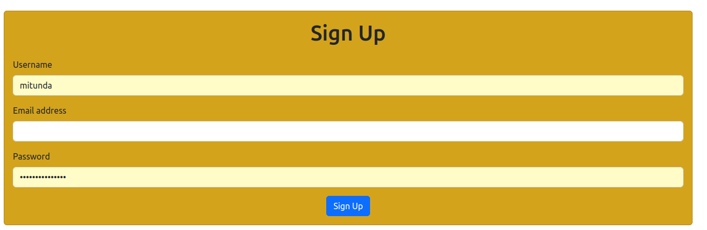

# Project Name

A simple web application for user signup and dashboard display using Vite, Bootstrap, and vanilla JavaScript.

## Layout


## Table of Contents

- [Introduction](#introduction)
- [Features](#features)
- [Getting Started](#getting-started)
  - [Prerequisites](#prerequisites)
  - [Installation](#installation)
- [Usage](#usage)
- [Contributing](#contributing)
- [License](#license)

## Introduction

This project is a simple web application built using Vite, a next-generation frontend build tool, and Bootstrap for styling. It provides a signup page where users can register, and a basic user dashboard page that displays a "Under Development" message.

## Features

- User signup form with fields for username, email, and password.
- Validation of user input on the client-side.
- Sending signup data to the backend server.
- User dashboard page with a "Under Development" message.

## Getting Started

### Prerequisites

Before you begin, ensure you have the following installed on your machine:

- Node.js (version 18 or higher)
- npm (Node Package Manager)

### Installation

1. Clone the repository:

   ```bash
   git clone https://github.com/your-username/your-project.git
   ```

2. Navigate to the project directory:

   ```bash
   cd your-project
   ```

3. Install dependencies:

   ```bash
   npm install
   ```

## Usage

1. Start the development server:

   ```bash
   npm run dev
   ```

2. Open your web browser and navigate to `http://localhost:3000` to access the signup page.
3. Fill in the signup form and click "Sign Up".
4. After signing up, you will be redirected to the user dashboard page where you'll see the "Under Development" message.

## Backend
- The backend of this project will be built using Flask, a lightweight WSGI web application framework written in Python. SQLAlchemy, a Python SQL toolkit and Object-Relational Mapper, will be used for database management.

## Contributing

Contributions are welcome! Feel free to open an issue or submit a pull request for any improvements or fixes.

## License

This project is licensed under the [MIT License](LICENSE).

---

Feel free to customize the README according to your specific project details, such as the project name, repository URL, and any additional instructions or features.